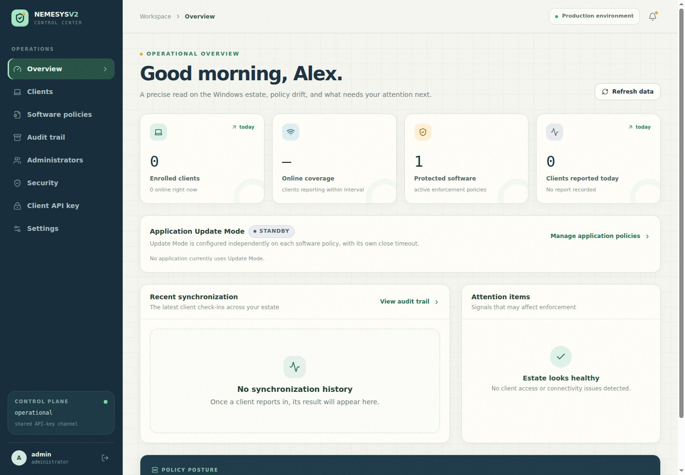
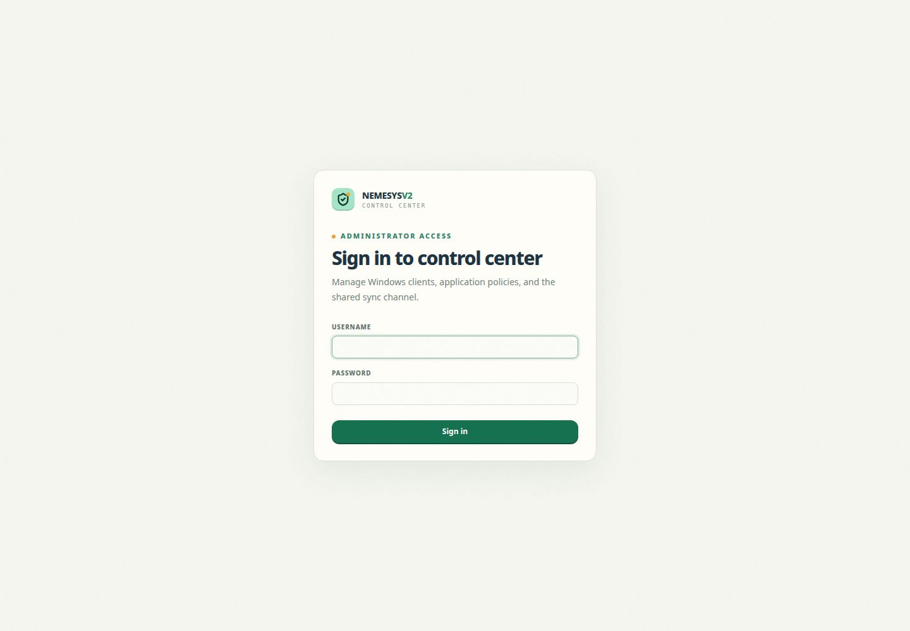
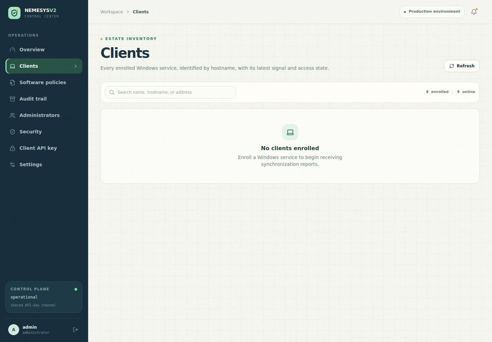
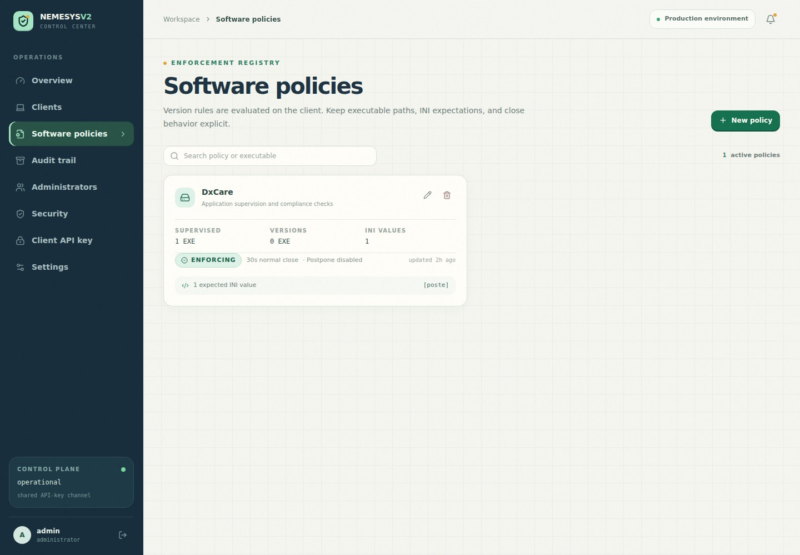
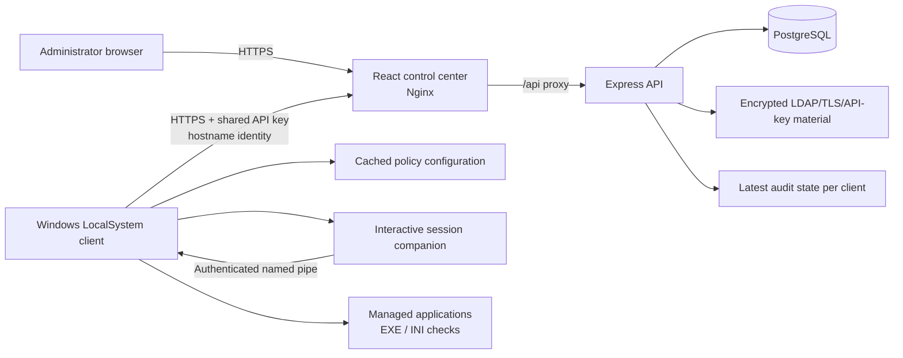

# NemesysV2 Update Management

[](https://github.com/andyelsen85-bit/NemesysV2-Update-Management/actions/workflows/build-images.yml)
[](https://github.com/andyelsen85-bit/NemesysV2-Update-Management/actions/workflows/build-msi.yml)

NemesysV2 is a centralized Windows software update-management platform. It combines a browser-based administrator control center, an Express/PostgreSQL API, and a LocalSystem Windows client that evaluates software policies, warns interactive users, closes managed processes safely, runs silent updates, and reports the latest compliance state.



## Key capabilities

- Enroll Windows clients by hostname and monitor their latest synchronization state.
- Define software policies using executable file-version checks and INI section/key/value checks with `<`, `<=`, `=`, `>=`, or `>` comparisons.
- Evaluate EXE and INI requirements together while treating multiple supervised processes as an OR condition.
- Warn the active Windows user before a managed application closes.
- Keep the warning visible without stealing keyboard focus from the user's current work.
- Allow policy-controlled postponement and separate normal/Update Mode close timeouts.
- Run optional silent update commands after managed processes close.
- Launch an application once when a policy leaves Update Mode.
- Store one latest audit result per client for current-state reporting.
- Manage administrators, LDAP settings, TLS certificates, API keys, and server settings.
- Deploy the control plane as containerized Kubernetes workloads.
- Build the x64 Windows client as a WiX MSI through GitHub Actions.

## Screenshots

### Administrator sign-in



### Windows client inventory



### Software policy management



## Architecture



### Components

| Component                   | Purpose                                                       |
| --------------------------- | ------------------------------------------------------------- |
| `artifacts/nemesys-console` | React/Vite administrator control center                       |
| `artifacts/api-server`      | Express management and client synchronization API             |
| `clients/windows-service`   | .NET 8 LocalSystem service and user-session warning companion |
| `lib/api-spec`              | OpenAPI source of truth                                       |
| `lib/api-client-react`      | Generated React Query API client                              |
| `lib/api-zod`               | Generated request and response validation schemas             |
| `lib/db`                    | Drizzle ORM schema and automatic database bootstrap           |
| `installer/windows`         | WiX v4 x64 MSI project                                        |
| `deploy/docker`             | API and web container definitions                             |
| `deploy/kubernetes`         | Kustomize base, test overlay, and migration references        |

## Policy and enforcement model

Each policy can define:

- one primary executable and additional supervised executables;
- one or more executable file-version expectations;
- one or more INI section/key/value expectations;
- a normal close timeout;
- an Update Mode close timeout;
- whether the user may postpone;
- an optional silent update command;
- an optional executable and arguments to launch after leaving Update Mode.

EXE and INI compliance checks use **AND** semantics: every configured requirement must pass. Running-process detection uses **OR** semantics: if any managed executable is running for a noncompliant policy, the user warning flow can begin.

Each EXE or INI check has its own comparison operator. Existing policies default to exact equality. For applications that can update themselves, configure `>=` so a version newer than the policy baseline remains compliant. Relational comparisons use dotted numeric version components, so `1.10` correctly compares as newer than `1.9`.

The client revalidates policy generation, compliance, cancellation state, and process state before destructive actions. If process discovery, session-companion authentication, process closure, or installer startup is uncertain, enforcement fails safely and retries later.

### Update Mode

- Normal polling is randomly jittered around five minutes.
- Polling changes to roughly 30 seconds while an enabled policy is in Update Mode.
- Update Mode has its own per-policy close timeout.
- Launch-on-exit runs only after the client observes a true-to-false Update Mode transition.
- Launch attempts are persisted by policy/cycle to prevent duplicates across service restarts.
- Self-update launch cycles own enforcement and cannot race the ordinary warning/close/install path.

## Windows client

The Windows client is a self-contained `win-x64` .NET 8 executable installed as the `NemesysV2Client` LocalSystem service.

### User warning behavior

The service itself never displays UI. It launches a short-lived companion inside the selected active Windows session and communicates through a service-owned, ACL-protected named pipe.

The warning dialog:

- remains visually topmost through non-activating z-order pinning;
- never steals keyboard focus from the user's current application;
- still accepts mouse clicks on **Close application now** and **Postpone**;
- cannot override a genuine exclusive-fullscreen application because that is controlled by Windows.

If the companion cannot launch, authenticate, connect, or reply, the service does not close the application.

### MSI installation

Builds from `main` are available as artifacts from the [Build Windows MSI workflow](https://github.com/andyelsen85-bit/NemesysV2-Update-Management/actions/workflows/build-msi.yml). Tagged releases also receive the MSI as a release asset.

Run an unattended installation from an elevated prompt:

```powershell
msiexec /i NemesysV2.Client.msi /qn `
  NEMESYS_SERVER="https://updates.example.local" `
  NEMESYS_API_KEY="<client-api-key>" `
  /l*v nemesys-msi.log
```

The MSI:

- installs per machine;
- stores the API key with machine-scoped Windows DPAPI;
- registers and starts the LocalSystem service;
- preserves ProgramData during upgrades;
- removes the service, installation directory, obsolete task, and ProgramData on true uninstall.

Client configuration and logs are stored under:

```text
C:\ProgramData\NemesysV2
```

Only the current daily `client-YYYYMMDD.log` file is retained. Synchronization failures are also written to the Windows Application Event Log.

For the complete client contract, see [`clients/windows-service/README.md`](clients/windows-service/README.md). For MSI lifecycle details, see [`installer/windows/README.md`](installer/windows/README.md).

## Technology stack

| Layer          | Technology                                  |
| -------------- | ------------------------------------------- |
| Web console    | React, Vite, TypeScript, TanStack Query     |
| API            | Node.js 24, Express 5, TypeScript           |
| Database       | PostgreSQL 16, Drizzle ORM                  |
| Validation     | Zod, generated OpenAPI schemas              |
| Windows client | .NET 8, Windows Service, WinForms companion |
| Installer      | WiX Toolset v4                              |
| Containers     | Docker/Buildx, Nginx                        |
| Orchestration  | Kubernetes, Kustomize                       |
| CI/CD          | GitHub Actions, GHCR                        |

## Local development

### Prerequisites

- Node.js 24
- pnpm 10
- PostgreSQL
- .NET 8 SDK with Windows targeting support for client compilation

### Install dependencies

```bash
pnpm install
```

### Environment variables

| Variable                 | Required  | Description                                              |
| ------------------------ | --------- | -------------------------------------------------------- |
| `DATABASE_URL`           | Yes       | PostgreSQL connection string                             |
| `SESSION_SECRET`         | Yes       | Signs administrator sessions and derives encryption keys |
| `NEMESYS_ADMIN_USERNAME` | Bootstrap | Initial administrator username                           |
| `NEMESYS_ADMIN_PASSWORD` | Bootstrap | Initial administrator password                           |

NemesysV2 is exposed over HTTPS on fixed port `443`.

Do not commit real credentials, API keys, database URLs, TLS private keys, or LDAP passwords.

### Start the applications

API:

```bash
pnpm --filter @workspace/api-server run dev
```

Console:

```bash
pnpm --filter @workspace/nemesys-console run dev
```

### Validate the workspace

```bash
pnpm run typecheck
pnpm run build
```

Regenerate the React client and Zod schemas after changing the OpenAPI specification:

```bash
pnpm --filter @workspace/api-spec run codegen
```

For development-only schema synchronization:

```bash
pnpm --filter @workspace/db run push
```

## API and authentication

All application endpoints are mounted under `/api`.

| Area                               | Authentication                            |
| ---------------------------------- | ----------------------------------------- |
| Administrator management endpoints | Signed HttpOnly session cookie            |
| Client `/sync/*` endpoints         | Shared client API key and hostname header |
| Health endpoint                    | Public                                    |

Major endpoint groups include:

- `/api/auth/*` — login, current administrator, password update, logout
- `/api/dashboard` — operational summary
- `/api/clients/*` — enrollment inventory and revocation
- `/api/software/*` — software policy management
- `/api/audit` — latest client compliance reports
- `/api/users/*` — administrator management
- `/api/settings/*` — server, LDAP, TLS, and client API-key settings
- `/api/sync/*` — Windows enrollment, configuration, and reporting

The OpenAPI contract is maintained in [`lib/api-spec/openapi.yaml`](lib/api-spec/openapi.yaml).

## Security model

- Administrator sessions use signed HttpOnly cookies.
- Client requests use a shared API key; the server stores a SHA-256 authentication hash and an encrypted recovery copy.
- Client identity is the Windows hostname. Reported IP addresses are informational.
- The client stores only the machine-DPAPI-encrypted API key in `client.json`.
- Windows clients require HTTPS and validate the server certificate with the Local Computer trust store, including hostname and validity checks.
- LDAP bind credentials and TLS private keys are encrypted at rest using a key derived from `SESSION_SECRET`.
- Warning responses are accepted only from the authenticated installed companion process in the selected user session.
- Destructive enforcement fails safely when state cannot be verified.

> [!IMPORTANT]
> Private-CA certificates require the issuing CA to be installed in each Windows machine's trusted root store. Expired, untrusted, and hostname-mismatched certificates are rejected.

## Container images

Pushes to `main`, version tags, and manual workflow runs build Linux/AMD64 images for:

- `nemesys-api-server`
- `nemesys-console`

Images are published to GHCR with branch, version, immutable commit-SHA, and `latest` tags as appropriate. See [`.github/workflows/build-images.yml`](.github/workflows/build-images.yml).

## Kubernetes deployment

The Kustomize deployment contains:

```text
deploy/kubernetes/
├── base/
├── migrations/
└── overlays/
    └── test/
```

Apply the test overlay after configuring secret-managed values, image-pull credentials, Nexus image paths, storage, and the public TLS hostname:

```bash
kubectl apply -k deploy/kubernetes/overlays/test
kubectl -n nemesys rollout status deployment/pg-deployment
kubectl -n nemesys rollout status deployment/nemesys-deployment
```

The API automatically provisions and upgrades its schema before listening. Upgrades run inside one PostgreSQL transaction protected by an advisory lock. The Kubernetes startup probe allows migration and lock-wait time before liveness checks begin.

The `DATABASE_URL` role must:

- own existing Nemesys tables;
- have `CREATE` permission on the `public` schema for fresh installations;
- have the normal read/write permissions required for data normalization.

The base deployment places API and web containers in the same Pod. Nginx owns ports 80/443 and proxies `/api/*` to the API over Pod-local HTTP. PostgreSQL and certificate data use persistent volumes.

Read [`deploy/kubernetes/README.md`](deploy/kubernetes/README.md) before applying an overlay, especially the PVC protection, certificate, secret-management, image-mirroring, and existing-database notes.

## Build and release automation

| Workflow           | Trigger              | Output                                                |
| ------------------ | -------------------- | ----------------------------------------------------- |
| `build-images.yml` | `main`, `v*`, manual | API and console container images in GHCR              |
| `build-msi.yml`    | `main`, `v*`, manual | Windows MSI workflow artifact; release asset for tags |

Use immutable SHA image tags for Kubernetes rollouts. Create a `v*` tag when publishing a release that should include a downloadable MSI asset.

## Additional documentation

- [Windows client behavior and diagnostics](clients/windows-service/README.md)
- [Windows MSI packaging and lifecycle](installer/windows/README.md)
- [Kubernetes deployment](deploy/kubernetes/README.md)
- [Windows client installation notes](docs/windows-client-install.md)
- [OpenAPI specification](lib/api-spec/openapi.yaml)
